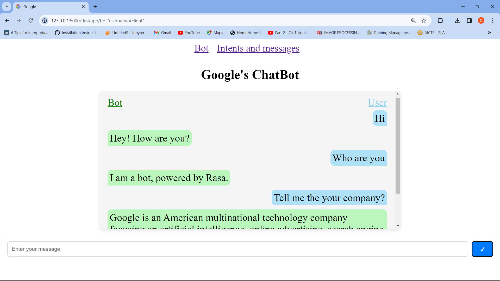
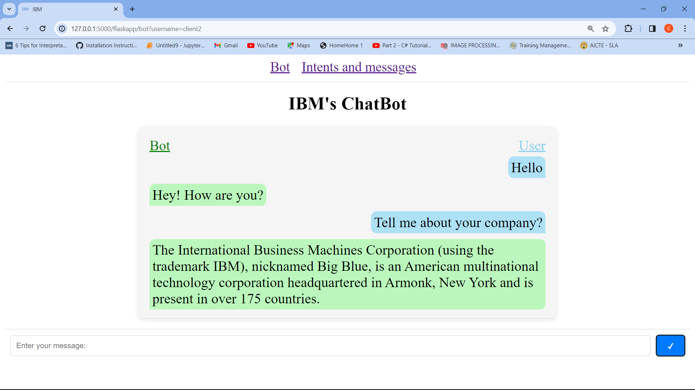
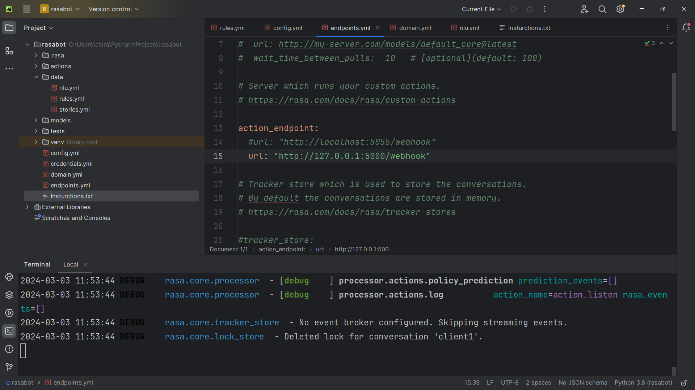
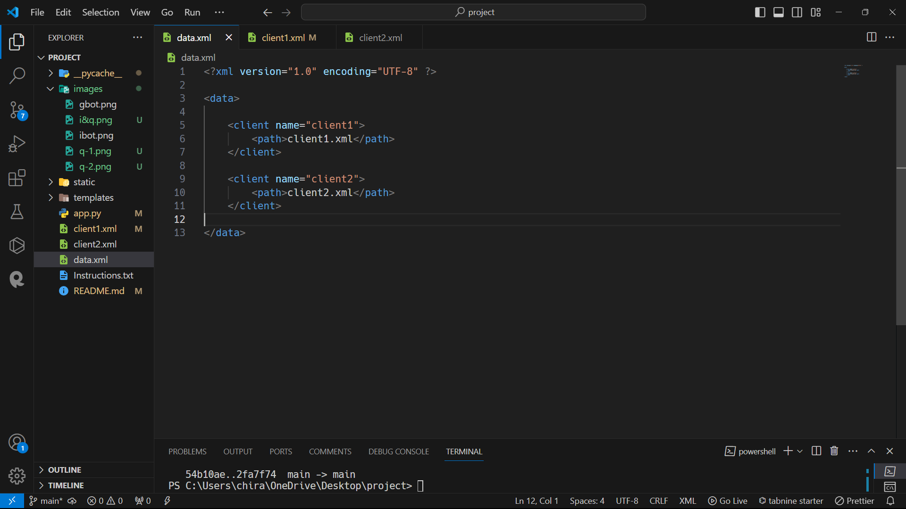
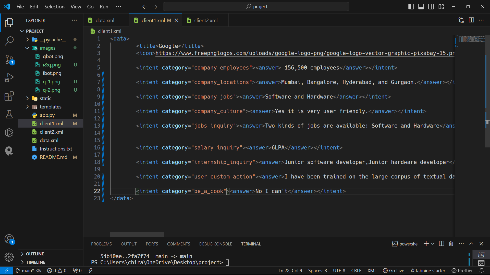
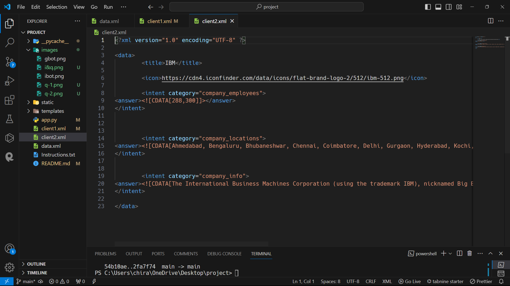
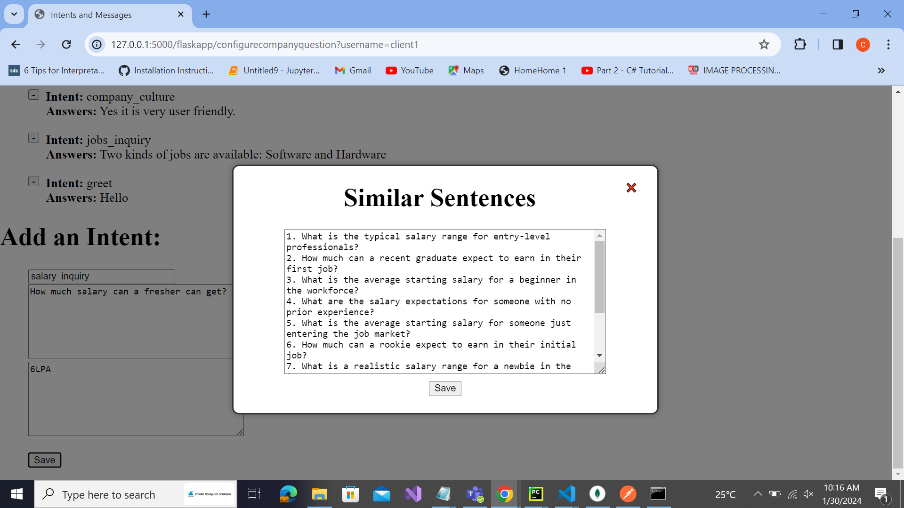
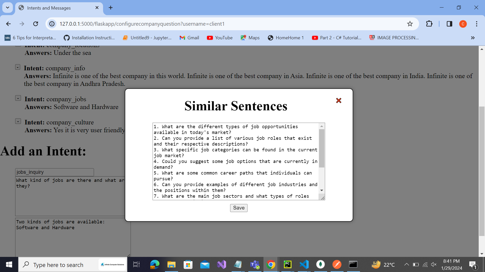
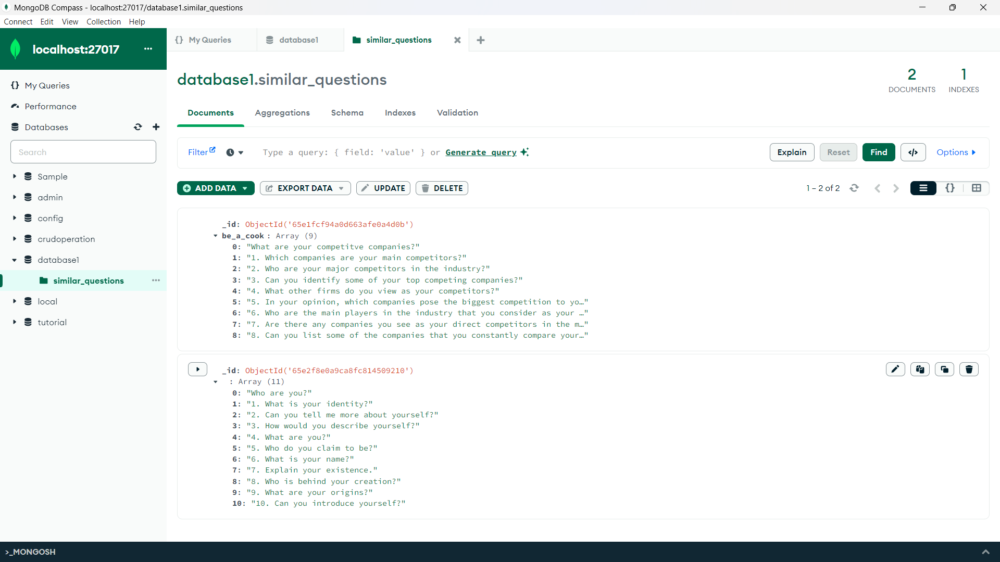

# This is a personal project done as part of my Internship program at Infinite Computer Soultions.
# The UI includes Combination of two ideas which includes:
## 1. Chatbot using rasa.
## 2. Intents and answers from clients.

## 1. Bot

### The features of chatbot are:
   #### Works for multiple different clients.

   

    <!-- First image -->
    
    <!-- Second image -->
    
    

   #### Performs Custom actions ----- with flask(by replacing the rasa custom actions endpoint with flask endpoint.)
   

    <!-- First image -->
    
    

## 2. Intents and answers

### The features of intents and answers are:
   #### The intents and answers are initially stored in XML files through which the individual client data is retrieved and displayed.

   

    <!-- First image -->
    
    <!-- Second image -->
    
    
    

   
   #### The New intents and corresponding answers can be added by the client. There also exists a feature where the the user or client able to get multiple similar questions for the question he/she gave as below. These questions or statements are generated by openai-chatgpt, and are fetched via api request.
   
   

    <!-- First image -->
    
    <!-- Second image -->
    
    

### Database used:
#### MongoDB for storing the similar questions with intent as key and list of questions/sentences as value.

   

    <!-- First image -->
    
    

## Prerequisites:
   ### Create a virtual environment within the same directory using command:
   #### python -m venv <env-name>
   ### Activate the virtual environment using the following command:
   #### <env-name>\Scripts\activate
   ### Install all these required packages:
   #### pip install flask
   #### pip install requests
   #### pip install pymongo
   #### pip install openai==0.28
